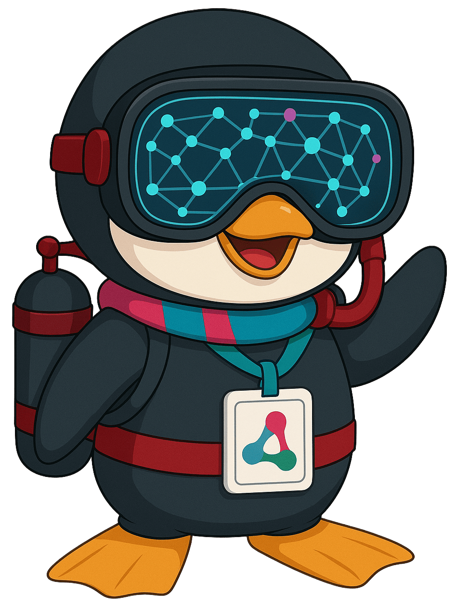
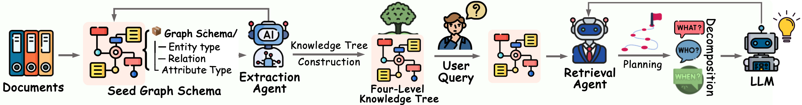
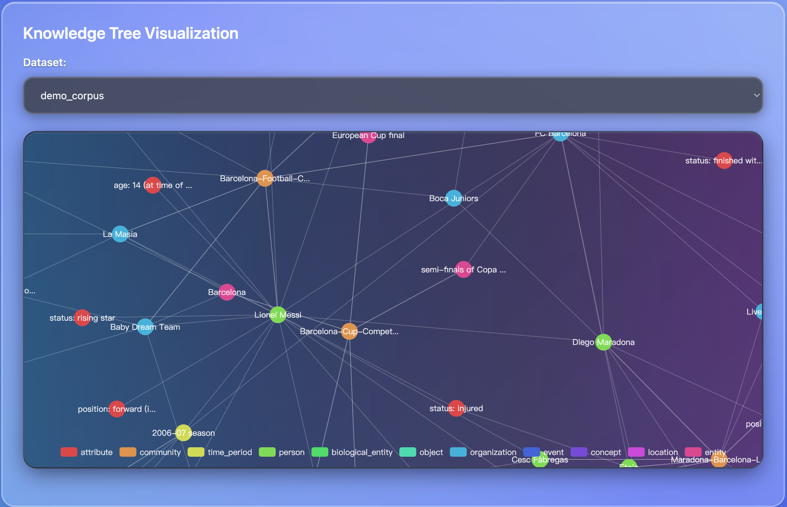
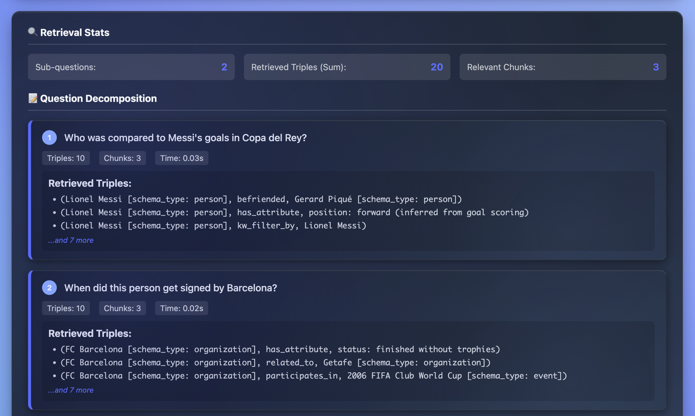
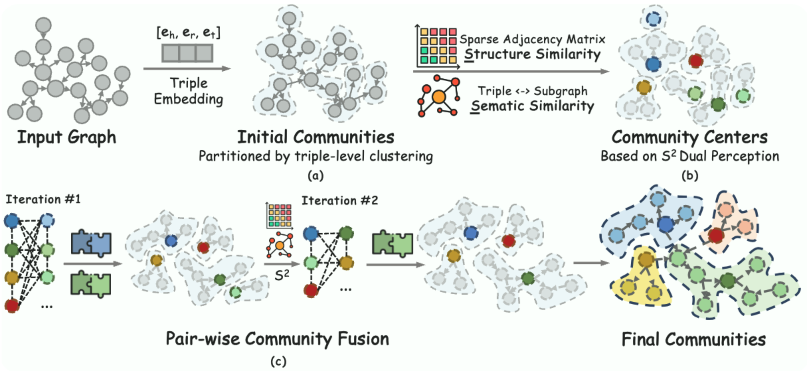
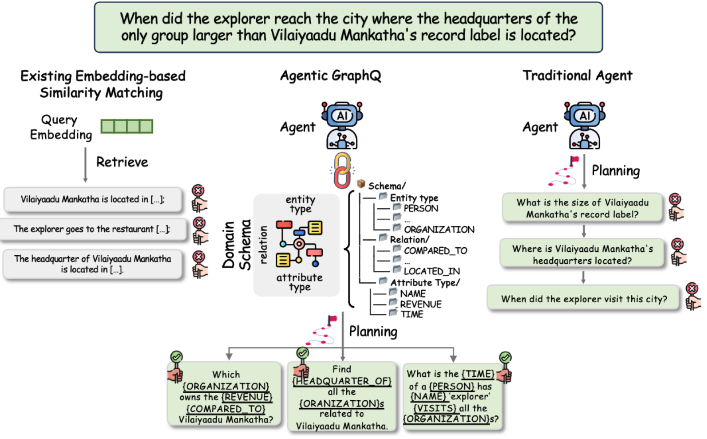
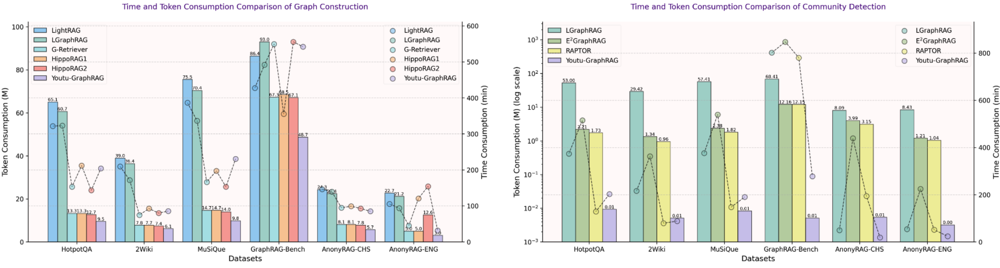
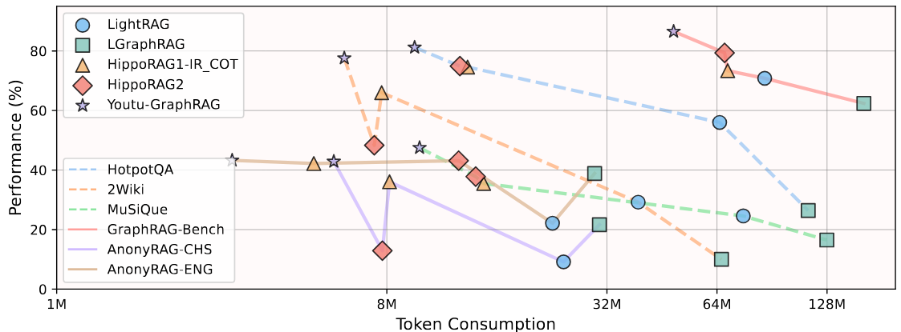
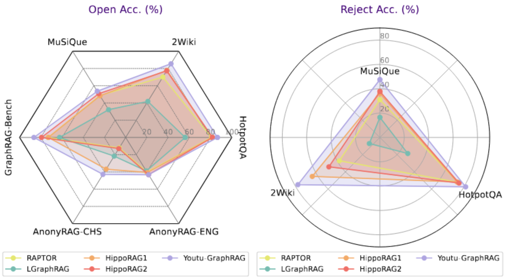

<div align="center">

#   Youtu-GraphRAG：垂直统一的图增强复杂推理新范式

[](LICENSE)
[](Youtu-GraphRAG.pdf)
[](assets/wechat_qr.png)
[](https://discord.gg/QjqhkHQVVM)
<a href=https://deepwiki.com/TencentCloudADP/youtu-graphrag></a>
[](https://github.com/TencentCloudADP/youtu-graphrag)

*🚀 重新定义图检索增强推理范式，以 33.6%的 Token 成本节约和 16.62% 的精度提升实现帕累托改进*

[🔖 English](README.md) • [🔖 日本語](README-JA.md) • [⭐ 核心贡献与创新](#contribution) • [📊 基准测试](https://huggingface.co/datasets/Youtu-Graph/AnonyRAG) • [🚀 快速开始](#quickstart)

</div>

## 🎯 项目简介
**Youtu-GraphRAG**是一个基于图 Schema 实现垂直统一的图增强推理范式，将 GraphRAG 框架精巧地集成为一个以智能体为核心的有机整体。我们实现了通过在图 Schema 上的最小化人为干预下进行跨领域的无缝迁移，为业界应用提供了泛化、准确、可用的下一代 GraphRAG 范式。



### 🎨 Youtu-GraphRAG 三大落地场景

🔗 **多跳推理与总结**：解决需要多步推理的复杂问题<br>
📚 **知识密集型任务**：处理依赖大量结构化知识的问题<br>
🌐 **跨域扩展**：轻松支持学术论文、个人知识库、私域/企业知识库等多个领域，Schema 人工干预最少化<br>

## 🏗️ 框架架构

<div align="center">
<br>
Youtu-GraphRAG 框架概览
</div>

## 📲 交互式体验界面

您也可以观看[演示视频](https://youtu.be/fVUsgClHqwc) 来了解 Youtu-GraphRAG 的主要特性。
<div align="center">


</div>

<a id="contribution"></a>
## 🚀 核心贡献与创新亮点

基于统一的图检索增强生成智能体范式，Youtu-GraphRAG 引入了多项关键创新，这些创新共同构建了一个精密集成的完整框架：

<summary><strong>🏗️ 1. Schema 引导的层次化知识树构建</strong></summary>

- 🌱 **种子图 Schema**：通过引入有针对性的实体类型、关系类型和属性类型，为自动化提取智能体提供精确约束
- 📈 **可扩展 Schema 演进**：支持动态扩展 Schema，实现了跨领域知识的自主演化和高质量抽取
- 🏢 **四层架构设计**：
  - **第 1 层（属性层）**：存储实体的属性信息
  - **第 2 层（关系层）**：构建实体间的关系三元组
  - **第 3 层（关键词层）**：建立关键词索引体系
  - **第 4 层（社区层）**：形成层次化的社区结构
- ⚡ **业界应用快速适配**：在 Schema 最小化人为干预的前提下，实现跨领域快速部署

<summary><strong>🌳 2. 结构语义双重感知的社区检测</strong></summary>

- 🔬 **创新社区检测算法设计**：巧妙融合结构拓扑特征与子图语义信息，构建全面的知识组织体系，在复杂网络中提炼高维度知识加强推理总结能力，社区生成效果显著优于传统 Leiden 和 Louvain 算法
- 📊 **层次化知识树**：自然生成既支持自顶向下过滤又支持自底向上推理的结构
- 📝 **智能社区摘要**：利用大语言模型增强社区摘要生成，实现更高层次的知识抽象

<div align="center">

</div>

<summary><strong>🤖 3. 智能迭代检索</strong></summary>

- 🎯 **Schema 感知的复杂问题分解**：深度理解图 Schema 结构，将复杂查询针对性智能转换为可并行处理的子查询
- 🔄 **迭代反思机制**：通过迭代检索思维链进一步实现深度反思，显著提升推理能力

<div align="center">

</div>

<summary><strong>🧠 4. 领先的落地级构建、索引与推理能力及用户友好体验</strong></summary>

- 🎯 **性能全面优化**：通过精心设计的提示策略、索引机制和检索算法，同时降低 Token 消耗并提升回答精度
- 🤹‍♀️ **用户体验友好**: ```output/graphs/```四层知识树结构支持 neo4j 直接导入可视化，知识归纳、推理路径对用户直接可见
- ⚡ **并行子问题处理**：采用并发机制处理分解后的问题，在复杂场景下仍能保持高效运行
- 🤔 **迭代推理演进**：逐步构建答案，并提供清晰的推理轨迹，增强结果可解释性
- 📊 **企业级扩展性**：专为私域及企业级部署而设计，新领域接入时人工干预降到最低

<summary><strong>📈 5. 公平匿名数据集'AnonyRAG'</strong></summary>

- Link: [Hugging Face AnonyRAG](https://huggingface.co/datasets/Youtu-Graph/AnonyRAG)
- **有效防范大语言模型和嵌入模型预训练过程中的知识泄露问题**
- **深度测试 GraphRAG 在真实场景下的检索性能表现**
- **提供中英文双语版本，支持多语言研究**

<summary><strong>⚙️ 6. 统一配置管理</strong></summary>

- 🎛️ **集中化参数管理**：所有组件均可通过单一 YAML 文件进行统一配置
- 🔧 **运行时动态调整**：支持在程序执行过程中动态修改配置参数
- 🌍 **多环境无缝支持**：在图 Schema 最小人为干预的前提下，轻松实现跨领域迁移
- 🔄 **完善向后兼容**：确保现有代码在框架升级后仍能正常运行

## 📊实验表现
我们在 GraphRAG-Bench、HotpotQA 和 MuSiQue 等六个专业跨领域多语言的基准数据集上进行了广泛实验，充分证明了 Youtu-GraphRAG 的企业级扩展性和泛化性。相比最先进的基线方法，Youtu-GraphRAG 显著推动了帕累托前沿突破，实现了最高<strong>33.6%的 Token 成本节约</strong>和<strong>16.62%的精度提升</strong>。实验结果充分展现了我们框架的卓越泛化性，能够在 Schema 干预最小化的前提下实现跨领域的无缝迁移。

<div align="center">



</div>

## 📁 项目结构

```
youtu-graphrag/
├── 📁 config/                     # 配置系统
│   ├── base_config.yaml           # 主配置文件
│   ├── config_loader.py           # 配置加载器
│   └── __init__.py                # 配置模块接口
│
├── 📁 data/                       # 数据目录
│
├── 📁 models/                     # 核心模型
│   ├── 📁 constructor/            # 知识图谱构建模块
│   │   └── kt_gen.py              # KTBuilder - 层次化图构建器
│   ├── 📁 retriever/              # 检索模块
│   │   ├── enhanced_kt_retriever.py  # KTRetriever - 主检索器
│   │   ├── agentic_decomposer.py     # 复杂查询解耦
│   └── └── faiss_filter.py           # DualFAISSRetriever - FAISS 检索器
│
├── 📁 utils/                      # 工具模块
│   ├── tree_comm.py               # 社区检测算法
│   ├── call_llm_api.py            # 大语言模型 API 调用
│   ├── eval.py                    # 评估工具
│   └── graph_processor.py         # 图处理工具
│
├── 📁 schemas/                    # 种子 Schema 定义
├── 📁 assets/                     # 静态资源（图片、图表等）
│
├── 📁 output/                     # 输出目录
│   ├── graphs/                    # 构建完成的知识图谱
│   ├── chunks/                    # 文本分块信息
│   └── logs/                      # 运行日志
│
├── 📁 retriever/                  # 检索缓存
│
├── main.py                       # 🎯 主程序入口
├── setup_env.sh                  # 安装 web 依赖库
├── start.sh                      # 启动 web 服务
├── requirements.txt              # 依赖包列表
└── README.md                     # 项目文档

```

<a id="quickstart"></a>

## 🚀 快速开始
提供 Docker 和源代码部署两种方式来运行并体验示例服务，考虑到基础环境差异的影响，推荐优先使用 **Docker**环境来启动。

### 💻 通过 Docker 启动

本启动方式依赖 Docker 环境，请参考 [官方文档](https://docs.docker.com/get-started/) 在本地安装环境。


```bash
# 1. 克隆项目
git clone https://github.com/TencentCloudADP/youtu-graphrag

# 2. 复制 .env.example 文件格式创建 .env
cd youtu-graphrag && cp .env.example .env
# 按照如下格式在 .env 中配置兼容 OpenAI API 格式的 LLM API
# LLM_MODEL=deepseek-chat
# LLM_BASE_URL=https://api.deepseek.com
# LLM_API_KEY=sk-xxxxxx

# 3. 通过 dockerfile 文件构建镜像
docker build -t youtu_graphrag:v1 .

# 4. 启动 docker 容器
docker run -d -p 8000:8000 youtu_graphrag:v1

# 5. 访问 http://localhost:8000 体验 Youtu-GraphRAG
curl -v http://localhost:8000
```

### 💻 直接启动 Web 服务体验交互式界面

本启动方式依赖 Python 3.10 和对应的 pip 环境，建议参照 [官方文档](https://docs.python.org/3.10/using/index.html) 安装。

```bash
# 1. 克隆项目
git clone https://github.com/TencentCloudADP/youtu-graphrag

# 2. 按照.env.example 文件格式创建 .env
cd youtu-graphrag && touch .env
# 按照如下格式在.env 中配置 OpenAI API 格式的 LLM API
# LLM_MODEL=deepseek-chat
# LLM_BASE_URL=https://api.deepseek.com
# LLM_API_KEY=sk-xxxxxx

# 3. 创建并激活虚拟环境
python -m venv venv
source venv/bin/activate  # Linux/macOS

# 4. 配置初始化环境 
./setup_env.sh

# 5. 启动服务
./start.sh

# 6. 访问 http://localhost:8000 体验 Youtu-GraphRAG

curl -v http://localhost:8000 # 检测服务是否正常运行
```

### 📖 完整使用指南
详细的安装、配置和使用说明请参考：[**🚀 完整指南**](FULLGUIDE.md)

## ⭐ **立即体验 Youtu-GraphRAG，开启智能问答的新篇章！** 🚀

## 🤝 参与贡献

我们诚挚欢迎社区的每一份贡献！您可以通过以下方式参与：

### 💻 代码贡献

1. 🍴 Fork 本项目到您的账户
2. 🌿 创建特性分支 (`git checkout -b feature/AmazingFeature`)
3. 💾 提交您的修改 (`git commit -m 'Add some AmazingFeature'`)
4. 📤 推送到远程分支 (`git push origin feature/AmazingFeature`)
5. 🔄 提交 Pull Request

### 🔧 扩展开发指南

- **🌱 新种子 Schema 开发**：贡献高质量的种子图 Schema 设计和数据处理逻辑
- **📊 自定义数据集集成**：在图 Schema 最小人为干预的前提下，集成新的数据集
- **🎯 领域特定应用**：展示特定领域最佳实践案例

## 📞 联系我们

**董俊男** - hansonjdong@tencent.com  **安思宇** - siyuan@tencent.com

---

## 🎉 学术引用

```bibtex
@misc{dong2025youtugraphrag,
      title={Youtu-GraphRAG: Vertically Unified Agents for Graph Retrieval-Augmented Complex Reasoning}, 
      author={Junnan Dong and Siyu An and Yifei Yu and Qian-Wen Zhang and Linhao Luo and Xiao Huang and Yunsheng Wu and Di Yin and Xing Sun},
      year={2025},
      eprint={2508.19855},
      archivePrefix={arXiv},
      url={https://arxiv.org/abs/2508.19855}, 
}
```
---
## Star History

[](https://www.star-history.com/#TencentCloudADP/youtu-graphrag&Date)