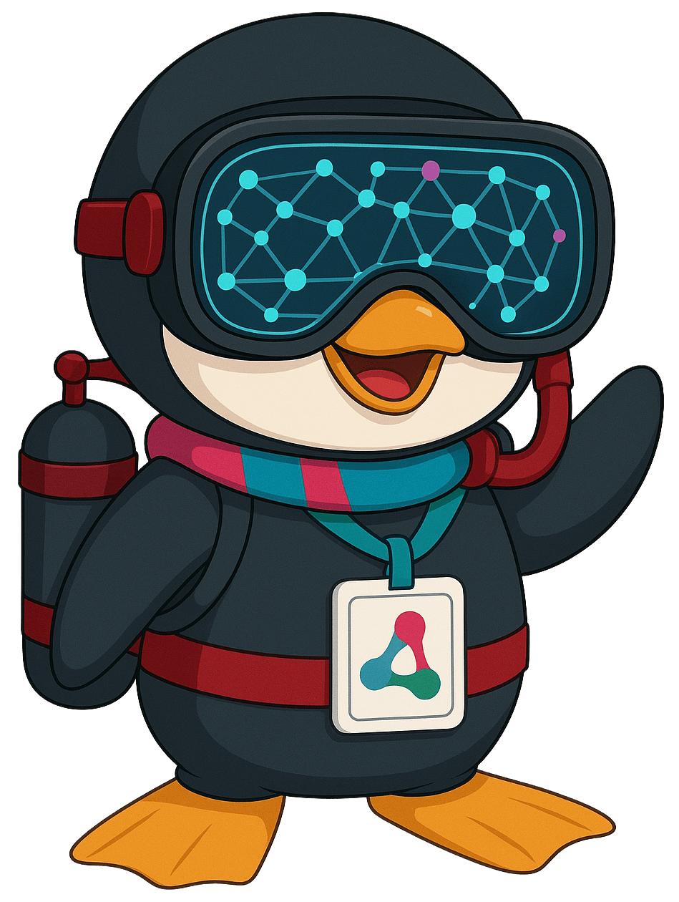
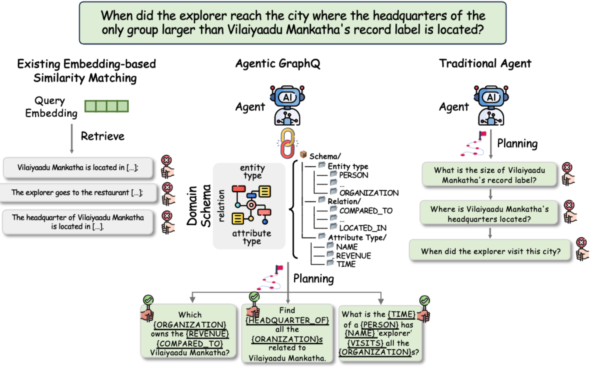
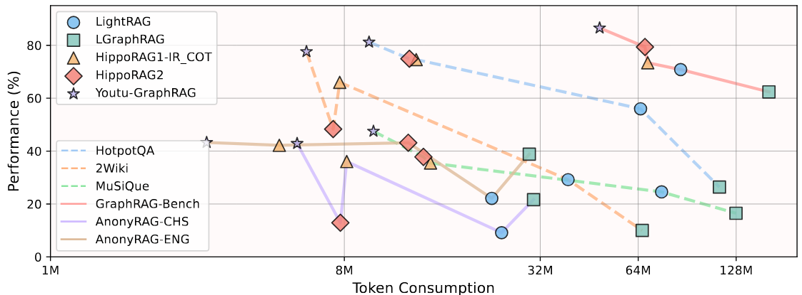
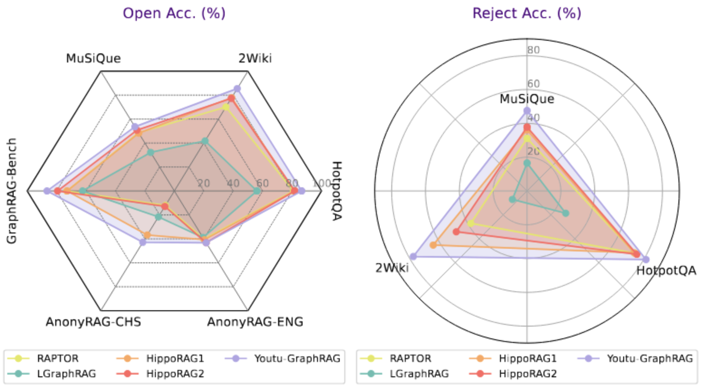

<div align="center">

#   Youtu-GraphRAG：垂直統合型のグラフ強化による複雑推論の新パラダイム

[](LICENSE)
[](Youtu-GraphRAG.pdf)
[](assets/wechat_qr.png)
[](https://discord.gg/QjqhkHQVVM)
<a href=https://deepwiki.com/TencentCloudADP/youtu-graphrag></a>
[](https://github.com/TencentCloudADP/youtu-graphrag)

*🚀 図形検索における推論パラダイムを再定義し、トークンコストを33.6%削減し、精度を16.62%向上させることでパレート改善を実現*

[🔖 English](README.md) • [🔖 中国語](README-CN.md) • [⭐ 核心贡献与创新](#contribution) • [📊 基准测试](https://huggingface.co/datasets/Youtu-Graph/AnonyRAG) • [🚀 快速开始](#quickstart)

</div>

## 🎯 プロジェクト紹介  
**Youtu-GraphRAG**は、グラフスキーマに基づいて垂直統合された推論パラダイムであり、GraphRAGフレームワークをエージェントを中心とした有機的な全体として巧みに統合しています。グラフスキーマ上での人為的介入を最小限に抑えつつ、異分野間でのシームレスな移行を実現し、業界向けに汎用性が高く、堅牢で実用的な次世代のGraphRAGパラダイムを提供します。



### 🎨 Youtu-GraphRAGの三大応用シナリオ  

🔗 **多段階推論と要約**：複数の推論ステップが必要な複雑な問題の解決  
📚 **知識集約型タスク**：大量の構造化された知識に依存する問題の処理  
🌐 **クロスドメイン拡張**：学術論文、個人知識ベース、企業内知識ベースなど、さまざまな分野に容易に対応可能。スキーマ設定における人的介入を最小限に抑える

## 🏗️ フレームワークアーキテクチャ

<div align="center">
<br>
Youtu-GraphRAG フレームワーク概要
</div>

## 📲 インタラクティブなインターフェース

Youtu-GraphRAGの主な特徴については、[デモビデオ](https://youtu.be/fVUsgClHqwc)もご覧いただけます。
<div align="center">


</div>

<a id="contribution"></a>

## 🚀 コア貢献とイノベーションのハイライト  
統一されたグラフ検索に基づく生成エージェントパラダイムに基づき、Youtu-GraphRAGは複数の重要なイノベーションを導入しており、これらのイノベーションが一体となって精密で統合された完全なフレームワークを構築しています。  

<summary><strong>🏗️ 1. スキーマによる階層的な知識ツリーの構築</strong></summary>

- 🌱 **シードグラフスキーマ**：ターゲットを絞ったエンティティタイプ、関係タイプ、属性タイプを導入することで、自動抽出処理に精密な制約を与える。  
- 📈 **スキーマの動的な拡張性**：スキーマを動的に拡張できるため、異分野間の知識の自律的な進化と高品質な抽出が実現される。  
- 🏢 **4層構造の設計**：  
  - **第1層（属性層）**：エンティティの属性情報を格納する。  
  - **第2層（関係層**：エンティティ間の関係を表すトリプルを構築する。  
  - **第3層（キーワード層**：キーワードのインデックスシステムを確立する。  
  - **第4層（コミュニティ層**：階層的なコミュニティ構造を形成する。  
- ⚡ **業界応用への迅速な適応**：人為的な介入を最小限に抑えつつ、異分野間での迅速な導入が可能。

<summary><strong>🌳 2. 構造・意味の二重認識に基づくコミュニティ検出</strong></summary>

- 🔬 **革新的なコミュニティ検出アルゴリズムの設計**：構造的なトポロジー特性とサブグラフの意味情報を巧みに統合し、包括的な知識組織体系を構築。複雑なネットワークから高次元の知識を抽出し、推論・要約能力を強化する。コミュニティ生成の効果は、従来のLeidenやLouvainアルゴリズムを大きく上回る。  
- 📊 **階層化された知識ツリー**：自然に生成されるこの構造は、トップダウン型のフィルタリングおよびボトムアップ型の推論の両方をサポートする。  
- 📝 **インテリジェントなコミュニティ要約**：大規模言語モデルを活用してコミュニティの要約生成を強化し、より高次元の知識抽象化を実現する。  

<div align="center">  
  
</div>  

<summary><strong>🤖 3. インテリジェントな反復検索</strong></summary>  
- 🎯 **スキーマ認識に基づく複雑な問題の分解**：グラフのスキーマ構造を深く理解し、複雑なクエリを並列処理可能なサブクエリに効率的に変換する。  
- 🔄 **反復的な推論メカニズム**：反復的な検索プロセスを通じてさらに深い推論を実現し、推論能力を大幅に向上させる。  

<div align="center">  
  
</div>

<summary><strong>🧠 4. 業界トップクラスの実用レベルでの構築、インデックス作成・推論能力、そしてユーザーフレンドリーな体験</strong></summary>

- 🎯 **性能の包括的な最適化**：入念に設計されたプロンプト戦略、インデックスメカニズム、検索アルゴリズムにより、トークン消費量を削減しつつ回答精度を向上させる  
- 🤹‍♀️ **ユーザーフレンドリーな体験**：4層構造の知識ツリーによりNeo4jデータを直接インポートして可視化でき、知識の帰納や推論過程がユーザーに直感的に表示される  
- ⚡ **並列処理**：分解された問題を並列処理することで、複雑なシナリオでも高い効率を維持  
- 🤔 **段階的な推論プロセス**：答えを段階的に構築し、明確な推論経路を提示することで結果の説明可能性を高める  
- 📊 **エンタープライズ向けの拡張性**：プライベート環境や企業向けに設計されており、新規分野への導入時の人的介入を最小限に抑える  

<summary><strong>📈 5. 公正かつ匿名性の高いデータセット「AnonyRAG」</strong></summary>

- リンク: [Hugging Face AnonyRAG](https://huggingface.co/datasets/Youtu-Graph/AnonyRAG)  
- **大規模言語モデルの事前学習における知識漏洩リスクの効果的な防止**  
- **実環境におけるGraphRAGの検索性能の評価**  
- **中国語・英語のバイリンガル版を提供し、多言語研究をサポート  

<summary><strong>⚙️ 6. 統一された設定管理</strong></summary>

- 🎛️ **パラメータの集中管理**：すべてのコンポーネントを単一のYAMLファイルで一元的に設定可能  
- 🔧 **実行時の動的調整**：プログラム実行中に設定パラメータを動的に変更できる  
- 🌍 **多様な環境へのシームレスな対応**：人為的な介入を最小限に抑えながら異なる環境間でのシームレスな移行を実現  
- 🔄 **完全な後方互換性**：フレームワークのアップグレード後も既存コードの正常な動作を保証  

## 📊 実験結果  
GraphRAG-Bench、HotpotQA、MuSiQueなど6つのベンチマークデータセットを用いた広範な実験により、Youtu-GraphRAGのエンタープライズ向けの拡張性および汎化能力が十分に証明された。最先端の手法と比較して、最大で**33.6%のトークン消費量削減**および**16.62%の精度向上**を実現。実験結果は、スキーマ設定への人為的介入を最小限に抑えつつ異分野間でのシームレスな適用が可能であることを示している。

- 🔧 **运行时动态调整**：支持在程序执行过程中动态修改配置参数
- 🌍 **多环境无缝支持**：在图 Schema 最小人为干预的前提下，轻松实现跨领域迁移
- 🔄 **完善向后兼容**：确保现有代码在框架升级后仍能正常运行

## 📊 実験結果

GraphRAG-Bench、HotpotQA、MuSiQueなど6つの専門的かつクロスドメイン対応の多言語ベンチマークデータセットを用いた広範な実験を通じて、Youtu-GraphRAGのエンタープライズレベルでの拡張性および汎化能力が十分に実証されました。最先端のベースライン手法と比較して、Youtu-GraphRAGは顕著な性能向上を達成し、<strong>トークンコストの削減率33.6%</strong>および<strong>精度の向上率16.62%</strong>を実現しました。実験結果は、スキーマへの介入を最小限に抑えつつ異分野間でのシームレスな移行が可能である本フレームワークの優れた汎化能力を如実に示しています。

<div align="center">



</div>

## 📁 プロジェクト構造

```bash
youtu-graphrag/
├── 📁 config/                     # 設定システム
│   ├── base_config.yaml           # メイン設定ファイル
│   ├── config_loader.py           | 設定読み込みモジュール
│   └── __init__.py                | 設定モジュールのインターフェース
│
├── 📁 data/                       | データディレクトリ
│
├── 📁 models/                     | コアモデルモジュール
│   ├── constructor/            | 知識グラフ構築モジュール
│   │   └── kt_gen.py              | KTBuilder（階層化グラフ構築ツール）
│   ├── retriever/              | 検索モジュール
│   │   ├── enhanced_kt_retriever.py     | KTRetriever（主要な検索エンジン）
│   │   ├── agentic_decomposer.py     | 複雑なクエリの処理モジュール
│   └── faiss_filter.py           | DualFAISSRetriever（FAISSを用いた検索エンジン）
│
├── 📁 utils/                      | ユーティリティモジュール
│   ├── tree_comm.py               | ネットワーク構造検出アルゴリズム
│   ├── call_llm_api.py            | 大規模言語モデル（LLM）API呼び出しモジュール
│   ├── eval.py                    | 評価ツール
│   └── graph_processor.py         | グラフ処理ツール
│
├── 📁 schemas/                    | シェーマ（データ構造の定義）
├── 📁 assets/                     | 静的リソース（画像、チャートなど）
│
├── 📁 output/                     | 出力ディレクトリ
│   ├── graphs/                    | 構築済みの知識グラフ
│   ├── chunks/                    | テキストデータのブロック情報
│   └── logs/                      | 実行ログ
├── retriever/                  | 検索キャッシュモジュール
│
├── main.py                       | メインプログラム（実行ファイル）
├── setup_env.sh                  | Webサービス用依存ライブラリのインストールスクリプト
│── start.sh                      | Webサービスの起動スクリプト
│── requirements.txt              | 依存パッケージ一覧
└── README.md                     | プロジェクトドキュメント
```

<a id="quickstart"></a>

## 🚀 クイックスタート  
サンプルサービスを実行して体験するための方法として、Dockerおよびソースコードからのデプロイの2つの方法を用意しています。基盤環境の違いによる影響を考慮すると、**Docker**環境を使用して起動することをお勧めします。  

### 💻 Dockerを使用して起動する  
この起動方法はDocker環境に依存するため、[公式ドキュメント](https://docs.docker.com/get-started/)を参照してローカルにDocker環境をインストールしてください。  

```bash
# 1. プロジェクトをクローンする  
git clone https://github.com/TencentCloudADP/youtu-graphrag  

# 2. `.env`ファイルを作成する  
cd youtu-graphrag && cp.env.example.env  
# `.env`ファイルにOpenAI API形式に準拠したLLM APIを以下の形式で設定する：  
# LLM_MODEL=deepseek-chat  
# LLM_BASE_URL=https://api.deepseek.com  
# LLM_API_KEY=sk-xxxxxx  

# 3. Dockerfileを使用してイメージをビルドする  
docker build -t youtu-graphrag:v1.  

# 4. Dockerコンテナを起動する  
docker run -d -p 8000:8000 youtu-graphrag:v1  

# 5. http://localhost:8000にアクセスしてYoutu-GraphRAGを体験する  
curl -v http://localhost:8000  
```

### 💻 Webサービスを直接起動してインタラクティブなインターフェースを体験する

この起動方法はPython 3.10および対応するpip環境に依存します。インストールについては、[公式ドキュメント](https://docs.python.org/3.10/using/index.html)を参照することをお勧めします。

```bash
# 1. プロジェクトをクローンする
git clone https://github.com/TencentCloudADP/youtu-graphrag

# 2..envファイルを作成する
cd youtu-graphrag && touch.env
#.envファイルにOpenAI API形式のLLM APIを以下のように設定する：
# LLM_MODEL=deepseek-chat
# LLM_BASE_URL=https://api.deepseek.com
# LLM_API_KEY=sk-xxxxxx

# 3. 仮想環境を作成し、有効化する
python -m venv venv
source venv/bin/activate  # Linux/macOS

# 4. 環境を初期化する
./setup_env.sh

# 5. サービスを起動する
./start.sh

# 6. http://localhost:8000にアクセスしてYoutu-GraphRAGを体験する
curl -v http://localhost:8000  # サービスが正常に動作しているかを確認する
```

### 📖 完全な使用ガイド
インストール、設定、使用方法の詳細については、[**🚀 完全ガイド**](FULLGUIDE.md)をご覧ください。  

## ⭐ **今すぐYoutu-GraphRAGを体験し、インテリジェントなQ&Aの新たな章を始めましょう！** 🚀  

## 🤝 貢献をお願いします

コミュニティからのあらゆる貢献を心から歓迎します！以下の方法で参加できます：  

### 💻 コード貢献  
1. このプロジェクトを自分のアカウントにフォークする  
2. 新機能用のブランチを作成する（`git checkout -b feature/AmazingFeature`）  
3. 変更内容をコミットする（`git commit -m '新機能を追加しました'`）  
4. リモートブランチにプッシュする（`git push origin feature/AmazingFeature`）  
5. プルリクエストを送信する  

### 🔧 拡張開発ガイド  
- **新しいシードスキーマの開発**：高品質なシードグラフスキーマの設計やデータ処理ロジックの貢献  
- **カスタムデータセットの統合**：人の介入を最小限に抑えながら新しいデータセットを統合する  
- **特定分野での応用**：その分野におけるベストプラクティスの事例を示す  

## 📞 お問い合わせ先  
**董俊男** – hansonjdong@tencent.com  
**安思宇** – siyuan@tencent.com  

---

## 🎉 学術的引用

```bibtex
@misc{dong2025youtugraphrag,
      title={Youtu-GraphRAG: Vertically Unified Agents for Graph Retrieval-Augmented Complex Reasoning}, 
      author={Junnan Dong and Siyu An and Yifei Yu and Qian-Wen Zhang and Linhao Luo and Xiao Huang and Yunsheng Wu and Di Yin and Xing Sun},
      year={2025},
      eprint={2508.19855},
      archivePrefix={arXiv},
      url={https://arxiv.org/abs/2508.19855}, 
}
```

---

## Star History

[](https://www.star-history.com/#TencentCloudADP/youtu-graphrag&Date)